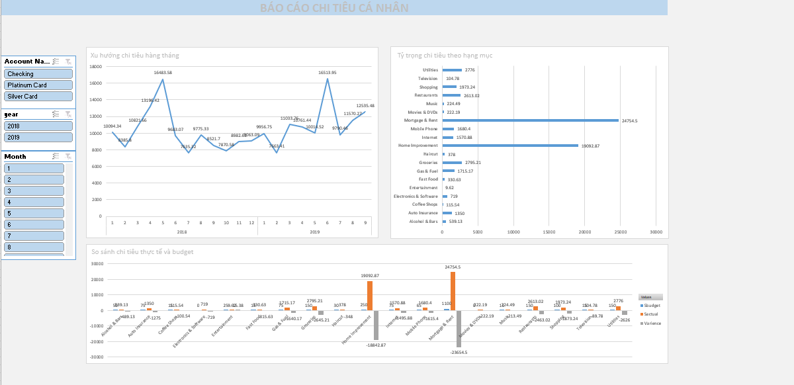

# 💰 Personal Expense Dashboard (Excel)
## 📸 Preview Dashboard

## 🎯 Mục tiêu dự án
Phân tích và theo dõi **chi tiêu cá nhân** trong giai đoạn **2018–2019**, nhằm:

- Hiểu rõ **xu hướng chi tiêu theo thời gian**  
- Nhận biết **các hạng mục chi tiêu chính** và sự chênh lệch giữa **thực tế và ngân sách (budget)**  
- Hỗ trợ **lập kế hoạch tài chính cá nhân** hiệu quả hơn  

---

## 📂 Nguồn dữ liệu
Dữ liệu được ghi lại từ các giao dịch cá nhân trong 2 năm (2018–2019), gồm các cột:

| Cột | Ý nghĩa |
|------|----------|
| Date | Ngày giao dịch |
| Description | Mô tả giao dịch (Amazon, Netflix, Grocery, v.v.) |
| Amount | Số tiền chi tiêu (+/-) |
| Transaction Type | Loại giao dịch (debit hoặc credit) |
| Category | Hạng mục chi tiêu (Shopping, Rent, Food, Entertainment, …) |
| Account Name | Tài khoản sử dụng (Checking, Platinum Card, Silver Card) |
| Month, Year | Phân loại thời gian cho phân tích |

---

## 🧹 Làm sạch & xử lý dữ liệu
Thực hiện trong **Microsoft Excel**:

### 🔧 Chuẩn hóa dữ liệu
- Loại bỏ dòng trống, định dạng lại cột **Date** và **Amount**  
- Đồng nhất chữ thường/hoa trong **Category** và **Account Name**  

### ➕ Thêm cột phân tích phụ
- `Month = MONTH(Date)`  
- `Year = YEAR(Date)`  
- `Transaction Type` dùng để lọc chi tiêu (debit) và thu nhập (credit)  

### 📑 Bảng tổng hợp (PivotTable)
- Tổng chi tiêu theo **năm**, **tháng**, **danh mục**, **tài khoản**  
- So sánh giữa **Actual vs Budget** (giá trị nhập thủ công hoặc tính trung bình)

---

## 📊 Trực quan hóa dữ liệu (Dashboard)
Dashboard gồm **3 biểu đồ chính**, có **bộ lọc (Slicer)** cho:
`Account Name`, `Year`, `Month`

### 1️⃣ Xu hướng chi tiêu hàng tháng
Biểu đồ **đường** thể hiện tổng chi tiêu từng tháng (2018–2019).  
→ Đỉnh chi tiêu xuất hiện vào **tháng 4/2018** và **tháng 5/2019** — có thể do chi phí nhà hoặc du lịch.

### 2️⃣ Tỷ trọng chi tiêu theo hạng mục
Biểu đồ **cột ngang** so sánh các danh mục chi tiêu.  
→ **Mortgage & Rent** và **Internet** là hai nhóm chi tiêu cao nhất.

### 3️⃣ So sánh chi tiêu thực tế và ngân sách (Actual vs Budget)
Biểu đồ **cột nhóm** theo danh mục, hiển thị:
- **Budget** (ngân sách đặt ra)  
- **Actual** (chi tiêu thực tế)  
- **Variance** = Actual – Budget  

→ Một số danh mục vượt ngân sách lớn như **Mortgage & Rent**, **Home Improvement**.

---

## 💡 Insight chính
- Chi tiêu tăng mạnh vào đầu và giữa năm, chủ yếu do **chi phí cố định** (nhà, internet).  
- **Mortgage & Rent** chiếm ~30% tổng chi tiêu → cần kiểm soát chi phí cố định tốt hơn.  
- Một số khoản vượt ngân sách (variance > 0) → cần **điều chỉnh kế hoạch tài chính**.  
- **Checking Account** được sử dụng thường xuyên cho giao dịch lớn.

---

## 🧠 Kết luận
Dashboard giúp theo dõi **chi tiêu cá nhân minh bạch, trực quan**, dễ dàng phát hiện các hạng mục **vượt ngân sách** và hỗ trợ quản lý tài chính hiệu quả hơn.

---

## 🛠️ Công cụ sử dụng
- Microsoft **Excel** (PivotTable, Slicer, Charts, Conditional Formatting)  
- **Data Cleaning & Visualization**

---

## 📁 File đính kèm
- `Personal_Expense_Analysis.xlsx` — file dashboard hoàn chỉnh  
- `README.md` — mô tả chi tiết dự án 
---

